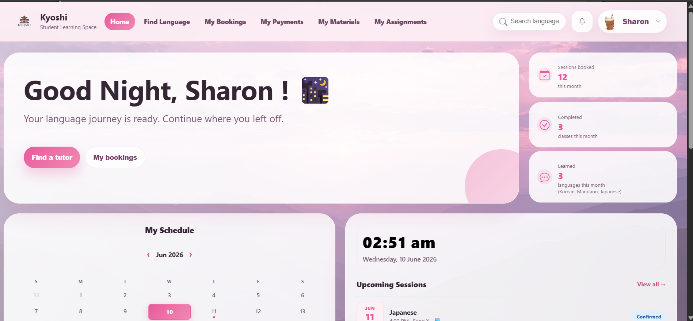
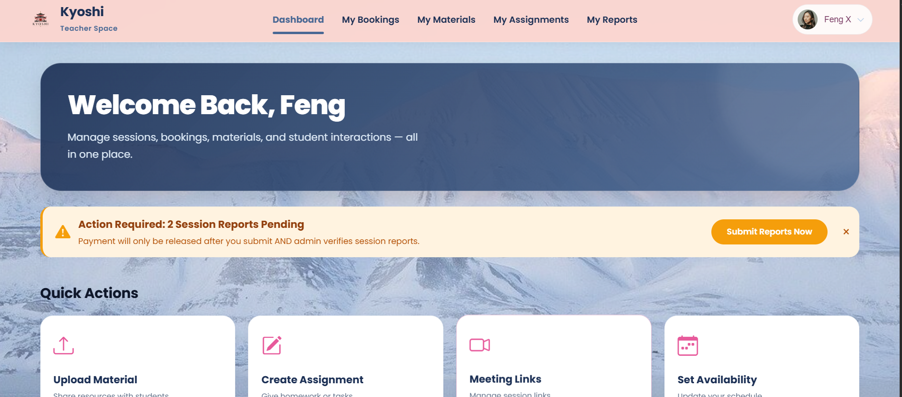
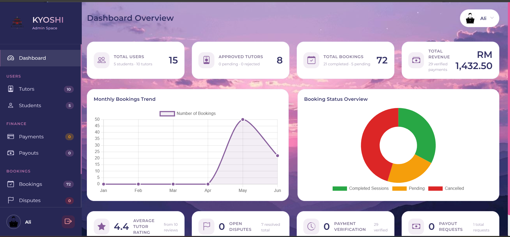

<p align="center">
  
</p>

<h1 align="center">🎌 KYOSHI Language Learning Platform</h1>

<p align="center">
  <strong>Connect • Learn • Grow</strong>
</p>

<p align="center">
  A comprehensive language learning platform connecting students with qualified tutors through a secure and user-friendly environment.
</p>

<p align="center">
  
  
  
  
  
</p>

<p align="center">
  <a href="https://kyoshitutor.site">
    
  </a>
</p>

---


---

# 📑 Table of Contents

- [📖 About The Project](#-about-the-project)
- [🎯 Project Objectives](#-project-objectives)
- [🌐 Live Demo](#-live-demo)
- [🔑 Default Test Accounts](#-default-test-accounts)
- [📸 User Interface Preview](#-user-interface-preview)
- [✨ Key Features](#-key-features)
- [🛠 Technology Stack](#-technology-stack)
- [📊 System Modules](#-system-modules)
- [🔐 Security Features](#-security-features)
- [💳 Payment Workflow](#-payment-workflow)
- [⚖️ Dispute Resolution Workflow](#️-dispute-resolution-workflow)
- [🗄 Database Structure](#-database-structure)
- [🚀 Installation Guide](#-installation-guide)
- [⏰ Cron Jobs & Automated Tasks](#-cron-jobs--automated-tasks)
- [📈 Future Enhancements](#-future-enhancements)
- [🏆 Project Achievements](#-project-achievements)
- [👥 Development Team](#-development-team)
- [🎓 Academic Information](#-academic-information)
- [🙏 Acknowledgements](#-acknowledgements)
- [📜 License](#-license)

---

# 📖 About The Project

KYOSHI is a web-based language learning platform developed to bridge the gap between students and qualified language tutors. The platform provides a complete ecosystem for tutor discovery, lesson booking, payment verification, learning material sharing, progress tracking, dispute management, session reporting, earnings management, and administrative control.

The system was designed to provide a seamless learning experience while maintaining security, transparency, efficiency, and accessibility for students, tutors, and administrators.

---

# 🎯 Project Objectives

- Connect students with qualified language tutors.
- Simplify lesson scheduling and booking.
- Provide secure payment and payout management.
- Support online and physical learning sessions.
- Improve communication between tutors and students.
- Track learning progress through reports and assignments.
- Streamline administrative operations.
- Promote accessible language education through technology.

---

# 🌐 Live Demo

### Website

[Visit KYOSHI Website](https://kyoshitutor.site)

---
## 🔑 Default Test Accounts

After installation, you can use these default accounts to test the platform:

### 👨‍💼 Admin Account
| Field | Value |
|-------|-------|
| Email | ali@gmail.com |
| Password | Ali@12345 |
| Role | Admin |

### 👨‍🏫 Tutor Account
| Field | Value |
|-------|-------|
| Email | haruka@kyoshi.com |
| Password | Tutor@12345 |
| Role | Tutor |

### 👨‍🎓 Student Account
| Field | Value |
|-------|-------|
| Email | sarah@gmail.com |
| Password | Sarah@12345 |
| Role | Student |

> ⚠️ **Note:** Change these default passwords in production environment.

---

### Features Available

- Tutor Browsing
- Tutor Booking
- User Authentication
- Student Dashboard
- Tutor Dashboard
- Admin Dashboard
- Learning Materials
- Payment Verification
- Session Reporting

> Some features require user authentication.

---

# 📸 User Interface Preview

## 🏠 Homepage


---

## 👨‍🎓 Student Dashboard



---

## 👨‍🏫 Tutor Dashboard



---

## 👨‍💼 Admin Dashboard



---


# ✨ Key Features

## 👨‍🎓 Student Features

- Search tutors by language and expertise
- Book online or physical tutoring sessions
- Manage bookings
- Upload payment proofs
- Download learning materials
- Submit assignments
- Track learning progress
- Save favourite tutors
- Submit disputes
- Rate and review tutors

---

## 👨‍🏫 Tutor Features

- Manage booking requests
- Configure availability schedules
- Upload certificates
- Upload learning materials
- Submit session reports
- Create assignments
- Monitor student progress
- Track earnings
- Request payouts

---

## 👨‍💼 Administrator Features

- Manage students and tutors
- Verify tutor qualifications
- Verify payments
- Resolve disputes
- Process refunds
- Process tutor payouts
- Approve session reports
- Manage platform activity
- Generate reports and analytics

---

# 🛠 Technology Stack

| Category | Technology |
|----------|------------|
| Backend | PHP |
| Frontend | HTML5, CSS3, JavaScript |
| Database | MySQL |
| Email Service | PHPMailer |
| PDF Generation | FPDF |
| Charts | Chart.js |
| Notifications | SweetAlert2 |
| Icons | Bootstrap Icons |
| Server | Apache |

---

# 📊 System Modules

### Authentication Module

- Login
- Registration
- Session Management
- Password Recovery

### Booking Module

- Tutor Discovery
- Schedule Management
- Booking Requests
- Booking Confirmation

### Payment Module

- Payment Verification
- Refund Processing
- Earnings Tracking
- Payout Management

### Learning Module

- Learning Materials
- Assignments
- Session Reports
- Progress Tracking

### Administrative Module

- User Management
- Tutor Verification
- Payment Verification
- Dispute Resolution
- Analytics Dashboard

---

# 🔐 Security Features

## Authentication Security

- Session-Based Authentication
- Role-Based Access Control
- Password Hashing (bcrypt)
- Secure Login Validation

## Database Security

- Prepared Statements
- SQL Injection Prevention
- Input Validation
- Secure Database Access

## Application Security

- Cross-Site Scripting (XSS) Protection
- Cross-Site Request Forgery (CSRF) Protection
- Secure File Upload Validation
- Restricted File Access

## Session Security

- HttpOnly Cookies
- Secure Session Handling
- Automatic Session Timeout

---

# 💳 Payment Workflow

```text
Student Books Session
        ↓
Payment Generated
        ↓
Upload Payment Proof
        ↓
Admin Verification
        ↓
Booking Approved
        ↓
Session Conducted
        ↓
Tutor Submits Report
        ↓
Admin Approval
        ↓
Tutor Earnings Updated
        ↓
Tutor Requests Payout
        ↓
Admin Processes Payout
```

---

# ⚖️ Dispute Resolution Workflow

```text
Issue Reported
      ↓
Dispute Submitted
      ↓
Admin Investigation
      ↓
Review Process
      ↓
Resolution Decision
      ↓
Refund / Reschedule / Reject
      ↓
User Notification
```

---

# 🗄 Database Structure

| Table   | Purpose                  |
|---------|---------|
| users   | User account management |
| tutors  | Tutor information |
| students | Student information |
| bookings | Lesson bookings |
| payments | Payment records |
| disputes | Dispute records |
| session_reports | Session reports |
| ratings | Reviews and ratings |
| notifications | System notifications |
| payout_requests | Tutor payout requests |

---


# 🚀 Installation Guide

### 1. Clone Repository

```bash
git clone https://github.com/siachinming/KyoshiLanguageTutorBookingAndSchedulingManagementSystem.git
cd kyoshi
```
### 2. Install Dependency

```bash
composer install
```

### 3. Create Database

```sql
CREATE DATABASE tutor CHARACTER SET utf8mb4 COLLATE utf8mb4_unicode_ci;
```
## 4. Import Database

```bash
mysql -u root -p tutor < database/tutor.sql
```

## 5. Configure Connection

Edit in this folder:

```php
config.php
```

Update your own details:

```php
define('DB_HOST', 'localhost');
define('DB_USER', 'root');
define('DB_PASS', 'your_password');
define('DB_NAME', 'tutor');
```
## 6. Set File Permission
```bash
chmod 755 uploads/
chmod 755 uploads/profiles/
chmod 755 uploads/certificates/
chmod 755 uploads/payment_proofs/
chmod 755 uploads/dispute_proofs/
chmod 755 uploads/learning_materials/
chmod 755 uploads/assignments/
chmod 755 uploads/materials/
chmod 755 uploads/profiles/
chmod 755 uploads/proofs/
chmod 755 uploads/refunds/
chmod 755 uploads/report_proofs/
chmod 755 uploads/reports/
chmod 755 uploads/learning_materials/
chmod 755 uploads/assignments/
chmod 755 uploads/materials/
chmod 755 assets/payment_img/
chmod 640 config.php

```
## 7. Start Application
You can either test in website and localhost

1. Start Apache
2. Start MySQL
3. Open:

```text
http://localhost/Kyoshi
```
---

# ⏰ Cron Jobs & Automated Tasks

KYOSHI uses **cron-job.org** (external cron service) for automated background tasks since InfinityFree hosting doesn't support native cron jobs.

## Cron Job Configuration

### External Cron Service Setup

1. **Sign up** at [cron-job.org](https://cron-job.org)
2. **Create cron jobs** with the following settings:

| # | Title | URL | Schedule |
|---|-------|-----|----------|
| 1 | AUTO CANCEL BOOKING | `https://kyoshitutor.site/php/auto_cancel_booking.php` | Daily at midnight (`0 0 * * *`) |
| 2 | AUTO COMPLETE SESSIONS | `https://kyoshitutor.site/php/auto_complete_sessions.php` | Daily at midnight (`0 0 * * *`) |
| 3 | AUTO REJECT | `https://kyoshitutor.site/php/cron_auto_reject.php` | Daily at midnight (`0 0 * * *`) |
| 4 | AUTO END SESSIONS | `https://kyoshitutor.site/php/auto_end_sessions.php` | Every 15 minutes (`*/15 * * * *`) |
| 5 | AUTO REJECT EXPIRED RESCHEDULE | `https://kyoshitutor.site/php/cron_reschedule_expire.php` | Daily at midnight (`0 0 * * *`) |
| 6 | KYOSHI REMINDERS | `https://kyoshitutor.site/php/send_reminders.php` | Daily at 9:00 PM (`0 21 * * *`) |
| 7 | KYOSHI SESSION REMINDERS | `https://kyoshitutor.site/php/send_session_reminder.php` | Daily at 8:50 PM (`50 20 * * *`) |

## Automated Tasks Summary

| Task | Frequency | Description |
|------|-----------|-------------|
| Auto-end sessions | Every 15 min | Marks completed sessions as finished |
| Auto-complete sessions | Daily midnight | Completes old sessions automatically |
| Auto-cancel booking | Daily midnight | Cancels no-show or expired bookings |
| Auto-reject | Daily midnight | Rejects expired tutor applications/requests |
| Auto-reject reschedule | Daily midnight | Handles expired reschedule requests |
| Session reminders | Daily 8:50 PM | Sends reminders for upcoming sessions |
| General reminders | Daily 9:00 PM | Sends general platform reminders |

## Cron Files Description

| File | Purpose |
|------|---------|
| `auto_cancel_booking.php` | Cancels unconfirmed or no-show bookings |
| `auto_complete_sessions.php` | Completes sessions from previous dates |
| `cron_auto_reject.php` | Rejects expired tutor applications/requests |
| `auto_end_sessions.php` | Ends sessions after booking time passes |
| `cron_reschedule_expire.php` | Handles expired reschedule requests |
| `send_reminders.php` | Sends general platform reminders |
| `send_session_reminder.php` | Sends session reminders to students |

## Crontab Expressions Explained

| Expression | Meaning |
|------------|---------|
| `*/15 * * * *` | Every 15 minutes |
| `0 0 * * *` | Daily at midnight (12:00 AM) |
| `50 20 * * *` | Daily at 8:50 PM |
| `0 21 * * *` | Daily at 9:00 PM |

## Manual Testing

To test any cron job manually:
```bash
# Via browser
https://kyoshitutor.site/php/auto_end_sessions.php

# Via cURL
curl -s https://kyoshitutor.site/php/auto_end_sessions.php

# Test all at once
for cron in auto_cancel_booking auto_complete_sessions cron_auto_reject auto_end_sessions cron_reschedule_expire send_reminders send_session_reminder; do
    curl -s "https://kyoshitutor.site/php/${cron}.php"
done
```
---

# 📈 Future Enhancements

- Real-Time Chat System
- Integrated Video Conferencing
- Mobile Application
- Attendance Tracking
- Digital Certificates
- Gamification Features
- AI Learning Assistant

---

# 🏆 Project Achievements

✅ Multi-role Authentication

✅ Tutor Management

✅ Student Management

✅ Booking Management

✅ Payment Verification

✅ Session Reporting

✅ Learning Material Management

✅ Dispute Resolution

✅ Earnings Tracking

✅ Payout Processing

✅ Responsive Web Design

---

# 👥 Development Team

| Team Member | Role | Responsibilities |
|------------|------|------------------|
| Soh Kay Hueen | Developer | Backend Development, Database Design, Authentication System, Payment System, Dispute Resolution Module |
| Sia Chin Ming | Scrum Master | Sprint Planning, Team Coordination, Requirement Management, Project Tracking |
| Taarunesh | Tester | Functional Testing, Bug Reporting, User Acceptance Testing, Quality Assurance |

---

# 🎓 Academic Information

**Project Name:** KYOSHI Language Learning Platform

**Institution:** UNIVERSITY TECHNOLOGY MALAYSIA (UTM)

**Programme:** Diploma in Computer Science

**Course:** Final Year Project (FYP)

**Project Type:** Web-based Language Learning Platform

**Academic Year:** 2026

**Supervisor:** Madam Maizatul Nasrin Binti Jajuli

**Submission Date:** 10 JUNE 2026

---

# 🙏 Acknowledgements

Special thanks to:

- PHP Community
- MySQL Community
- PHPMailer
- FPDF
- Chart.js
- Bootstrap Icons
- SweetAlert2
- Open Source Contributors

---

# 📜 License

This project is developed for academic and educational purposes.

All rights reserved.

Unauthorized reproduction, distribution, or commercial use is prohibited.

---

# ⭐ Version History

| Version | Date | Description |
|----------|----------|----------|
| 1.5.0 | June 2026 | Major UI Enhancement & Online Deployment |
| 1.0.0 | May 2026 | Initial Release |
---

<p align="center">
  © 2026 KYOSHI Language Learning Platform
</p>